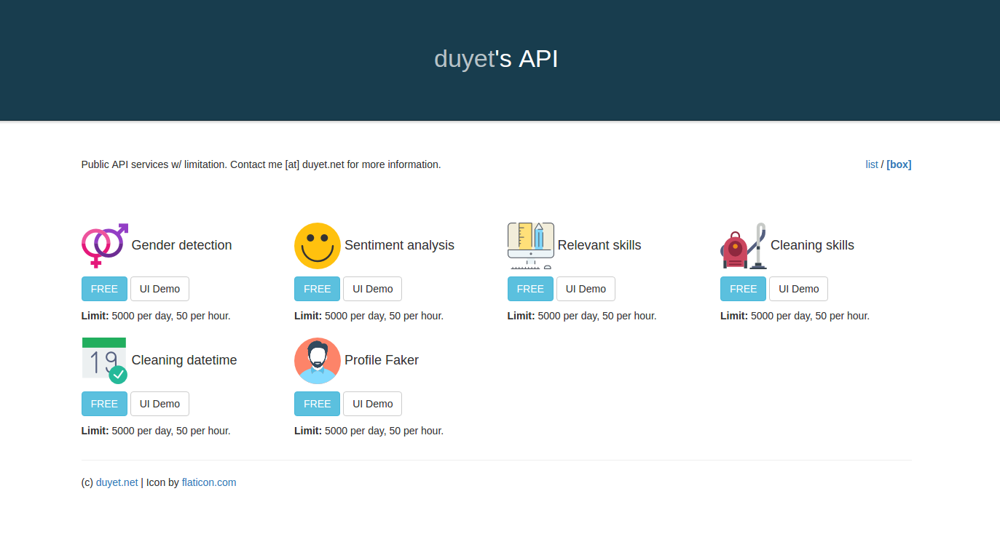

## api.duyet.net - [Website](https://api.duyet.net)

Free public api service.



## Run Locally
1. Install the [App Engine Python SDK](https://developers.google.com/appengine/downloads).
See the README file for directions. You'll need python 2.7 and [pip 1.4 or later](http://www.pip-installer.org/en/latest/installing.html) installed too.

2. Clone this repo with

   ```
   git clone https://github.com/duyet-website/api.duyet.net
   ```
3. Install dependencies in the project's lib directory.
   Note: App Engine can only import libraries from inside your project directory.

   ```
   cd api.duyet.net
   pip install -r requirements.txt -t lib
   ```
4. Run this project locally from the command line:

   ```
   dev_appserver.py .
   ```

Visit the application [http://localhost:8080](http://localhost:8080)

See [the development server documentation](https://developers.google.com/appengine/docs/python/tools/devserver)
for options when running dev_appserver.

## Deploy
To deploy the application:

1. Use the [Admin Console](https://appengine.google.com) to create a
   project/app id. (App id and project id are identical)
1. [Deploy the
   application](https://developers.google.com/appengine/docs/python/tools/uploadinganapp) with

   ```
   gcloud app deploy
   ```

### Feedback
Star this repo if you found it useful. Use the github issue tracker to give
feedback on this repo.

## Licensing

See [LICENSE](LICENSE)

## Author

Van-Duyet Le (@duyetdev)

